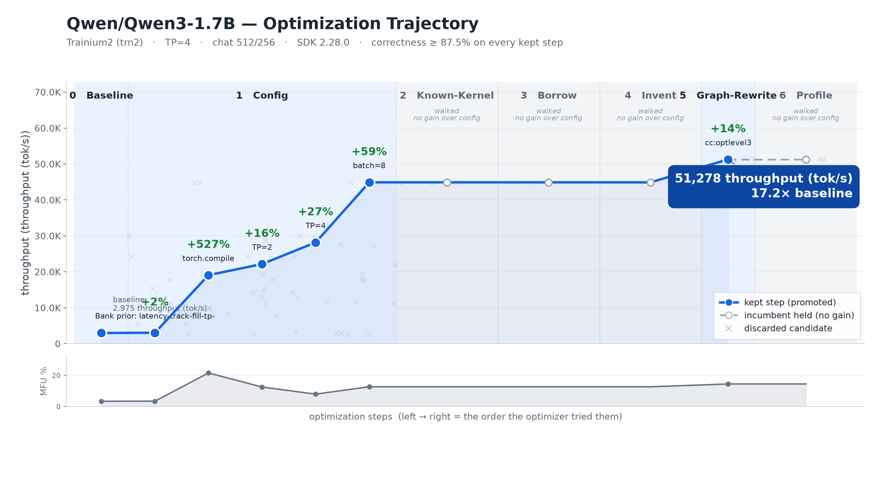

# Autonomous Trainium Model Optimizer

Point it at any HuggingFace model → it optimizes for Trainium2, verifies
correctness, publishes a reproducible recipe, and banks every trick so the
next model is cheaper to optimize. Repeat across the top open models and
publish a Neuron-optimized leaderboard that refreshes on each SDK release.



*Qwen3-1.7B, optimized end-to-end on one trn2.3xlarge → 51,278 tok/s = 17.2×
the eager baseline, correctness-verified. Recipes + charts: [`optimized_models/`](./optimized_models/).*

## Quickstart

```bash
git clone https://github.com/arminagha1234/trainium-optimizer
cd trainium-optimizer && pip install -e .
python -m optimizer.run --backend mock      # hardware-free end-to-end demo (~90s)
```

Full guide: [QUICKSTART.md](./QUICKSTART.md). Real Neuron backends need the
on-device toolchain — see [implementation/ENVIRONMENT.md](./implementation/ENVIRONMENT.md).

## How it works

An outer loop optimizes each model through a cheapest-first pipeline, gated by
correctness + a %SOL check at every step:

1. **Config search** — TP / dtype / batch / `torch.compile(backend="neuron")`. Most of the speedup lands here.
2. **Harvest** — reuse a banked, on-device-validated kernel when the model exposes a known primitive (FlashAttention, GatedDeltaNet, KDA, Mamba2, …).
3. **Author** — write a new NKI kernel *only where the compiler is weak* (long-context/sparse attention, linear-attention scans). On standard ops the compiler is already ~80% of speed-of-light, so we don't.
4. **Verify & publish** — a logprob/KL correctness gate, then a reproducible recipe.
5. **Bank & compound** — every win becomes a lesson, so model N+1 is cheaper than model N.

## Leaderboard

Verified results from the autonomous loop on real Trainium (`native-pytorch-beta3`), ranked by **peak throughput** (tok/s) with the config that achieved it.
Full standings (incl. speedup over the eager baseline): [LEADERBOARD.md](./LEADERBOARD.md) · per-model recipes: [`optimized_models/`](./optimized_models/).

<!-- LEADERBOARD:START -->
| Rank | Model | Family | Params | Peak (tok/s) | Config | Hardware | Status |
|-----:|:------|:-------|-------:|-------------:|:-------|:-------------|:-------|
| 🥇 | gpt2 | gpt2 | — | **156,974** | (config-only) | trn2.3xlarge | ✅ Verified |
| 🥈 | OLMo-1B-0724-hf | olmo | 1B | **87,175** | (config-only) | trn2.3xlarge | ✅ Verified |
| 🥉 | Qwen3-0.6B | qwen3 | 0.6B | **85,937** | TP=4, torch.compile(neuron), bf16, batch=8 | trn2.3xlarge | ✅ Verified |
| 4 | deepseek-coder-1.3b-instruct | deepseek | 1.3B | **81,574** | (config-only) | trn2.3xlarge | ✅ Verified |
| 5 | Qwen2.5-0.5B-Instruct | qwen2.5 | 0.5B | **74,269** | TP=2, torch.compile(neuron), bf16, batch=8, DP=2 | trn2.3xlarge | ✅ Verified |
| 6 | gpt2-medium | gpt2 | — | **61,158** | (config-only) | trn2.3xlarge | ✅ Verified |
| 7 | Qwen2.5-1.5B-Instruct | qwen2.5 | 1.5B | **59,241** | TP=4, torch.compile(neuron), bf16, batch=8 | trn2.3xlarge | ✅ Verified |
| 8 | Qwen3-1.7B | qwen3 | 1.7B | **51,278** | TP=4, torch.compile(neuron), bf16, batch=8 | trn2.3xlarge | ✅ Verified |
| 9 | SmolLM2-1.7B-Instruct | smollm2 | 1.7B | **50,650** | TP=4, torch.compile(neuron), bf16, batch=8 | trn2.3xlarge | ✅ Verified |
| 10 | bloom-560m | bloom | — | **48,320** | (config-only) | trn2.3xlarge | ✅ Verified |
| 11 | TinyLlama-1.1B-Chat-v1.0 | tinyllama | 1.1B | **48,108** | torch.compile(neuron) | trn2.3xlarge | ✅ Verified |
| 12 | SmolLM2-360M-Instruct | smollm2 | — | **48,064** | (config-only) | trn2.3xlarge | ✅ Verified |
| 13 | granite-3.1-2b-instruct | granite | 2B | **38,708** | (config-only) | trn2.3xlarge | ✅ Verified |
| 14 | Qwen2.5-Coder-1.5B | qwen2.5 | 1.5B | **38,369** | torch.compile(neuron) | trn2.3xlarge | ✅ Verified |
| 15 | Qwen2.5-3B-Instruct | qwen2.5 | 3B | **35,343** | TP=4, torch.compile(neuron), bf16, batch=8 | trn2.3xlarge | ✅ Verified |
| 16 | gemma-2-2b | gemma | 2B | **34,051** | TP=4, torch.compile(neuron), bf16, batch=8, CP=2 | trn2.3xlarge | ✅ Verified |
| 17 | SmolLM2-360M | smollm2 | — | **31,764** | (config-only) | trn2.3xlarge | ✅ Verified |
| 18 | gpt2-large | gpt2 | — | **30,620** | (config-only) | trn2.3xlarge | ✅ Verified |
| 19 | Qwen3-4B | qwen3 | 4B | **26,548** | TP=4, torch.compile(neuron), bf16, batch=8, CP=2 | trn2.3xlarge | ✅ Verified |
| 20 | bloom-1b7 | bloom | — | **24,852** | (config-only) | trn2.3xlarge | ✅ Verified |
| 21 | Mistral-7B-Instruct-v0.3 | mistral | 7B | **23,270** | TP=4, torch.compile(neuron), bf16, batch=32 | trn2.3xlarge | ✅ Verified |
| 22 | opt-1.3b | opt | 1.3B | **21,077** | torch.compile(neuron) | trn2.3xlarge | ✅ Verified |
| 23 | deepseek-llm-7b-base | deepseek | 7B | **20,702** | (config-only) | trn2.3xlarge | ✅ Verified |
| 24 | Qwen3.5-4B | qwen3.5 | 4B | **20,470** | TP=16, torch.compile(neuron), bf16, batch=1 | trn2.48xlarge | ✅ Verified |
| 25 | Qwen2.5-Coder-7B | qwen2.5 | 7B | **19,866** | torch.compile(neuron) | trn2.3xlarge | ✅ Verified |
| 26 | Qwen2.5-Math-7B | qwen2.5 | 7B | **19,826** | torch.compile(neuron) | trn2.3xlarge | ✅ Verified |
| 27 | Qwen3-8B | qwen3 | 8B | **16,876** | TP=4, torch.compile(neuron), bf16, batch=8, CP=2 | trn2.3xlarge | ✅ Verified |
| 28 | SmolLM2-1.7B | smollm2 | 1.7B | **14,460** | (config-only) | trn2.3xlarge | ✅ Verified |
| 29 | stablelm-2-1_6b | stablelm | 6B | **14,183** | (config-only) | trn2.3xlarge | ✅ Verified |
| 30 | pythia-1.4b | pythia | 1.4B | **13,294** | (config-only) | trn2.3xlarge | ✅ Verified |
| 31 | opt-2.7b | opt | 2.7B | **11,649** | (config-only) | trn2.3xlarge | ✅ Verified |
| 32 | Qwen3-14B | qwen3 | 14B | **10,343** | TP=4, torch.compile(neuron), bf16, batch=8 | trn2.3xlarge | ✅ Verified |
| 33 | Qwen2.5-14B-Instruct | qwen2.5 | 14B | **10,256** | TP=4, torch.compile(neuron), bf16, batch=8, CP=2 | trn2.3xlarge | ✅ Verified |
| 34 | Qwen2.5-7B-Instruct | qwen2.5 | 7B | **9,870** | TP=4, bf16, batch=8 | trn2.3xlarge | ✅ Verified |
| 35 | phi-2 | phi | — | **9,841** | (config-only) | trn2.3xlarge | ✅ Verified |
| 36 | RedPajama-INCITE-Instruct-3B-v1 | redpajama | 3B | **9,824** | (config-only) | trn2.3xlarge | ✅ Verified |
| 37 | stablelm-3b-4e1t | stablelm | 3B | **7,721** | (config-only) | trn2.3xlarge | ✅ Verified |
| 38 | pythia-2.8b | pythia | 2.8B | **6,450** | (config-only) | trn2.3xlarge | ✅ Verified |
| 39 | Qwen3-32B | qwen3 | 32B | **3,698** | TP=4, torch.compile(neuron), bf16, batch=1, CP=2 | trn2.3xlarge | ✅ Verified |
| 40 | Qwen3.5-35B-A3B | qwen3.5 | 35B | **2,695** | TP=16, bf16, batch=8 | trn2.48xlarge | ✅ Verified |
| 41 | Qwen3.5-0.8B | qwen3.5 | 0.8B | **1,143** | TP=4, bf16, batch=1 | trn2.48xlarge | ✅ Verified |
| 42 | Qwen3.5-2B | qwen3.5 | 2B | **1,129** | TP=4, bf16, batch=1 | trn2.48xlarge | ✅ Verified |
| 43 | Qwen3.8-27B | qwen3.8 | 27B | **343** | TP=8, bf16, batch=1 | trn2.48xlarge | ✅ Verified |
| 44 | DeepSeek-V4-Flash | deepseek | 284B | **0.03** | TP=1, fp4_experts+fp8_rest->bf16 (dequant on-device), batch=1 | trn2.48xlarge | ✅ Verified |
<!-- LEADERBOARD:END -->

*Speedup is vs the eager baseline on the same instance + probe shape. ✅ Verified
= correctness-gated + reproducible via each model's `reproduce.sh`.*

## Repo map

| Path | What |
|------|------|
| `optimizer/` | CLI — `python -m optimizer.{run,apply,measure}` |
| `implementation/src/` | the framework — orchestrator, backends, kernel authoring, opportunity sweep |
| `knowledge-bank/` | the compounding lesson + kernel store |
| `optimized_models/` | published recipe bundles |
| [`plan.md`](./plan.md) | roadmap + strategy — **read first** |
| [`architecture.md`](./architecture.md) · [`optimization-stages.md`](./optimization-stages.md) · [`docs/`](./docs) | design deep-dives |

## Design principles

- **Optimize only where the compiler is weak.** Measured on-device: the compiler is ~80% of speed-of-light on standard ops; NKI wins only in the compiler-weak regime (long-context/sparse attention, scans). Target selection is driven by measured %SOL.
- **Borrow before invent.** Reuse a proven kernel first; a novel one must beat it by ≥5%.
- **Honest measurement.** Speedup vs `torch.compile`-fused, reported as % of speed-of-light, device-timed (never host wallclock). Losses are banked as anti-patterns.
- **Compounding bank.** Lessons make each successive model cheaper — the flywheel.

Prior art: [references-analysis.md](./references-analysis.md) · shapes/ceilings: [guardrails.md](./guardrails.md).
