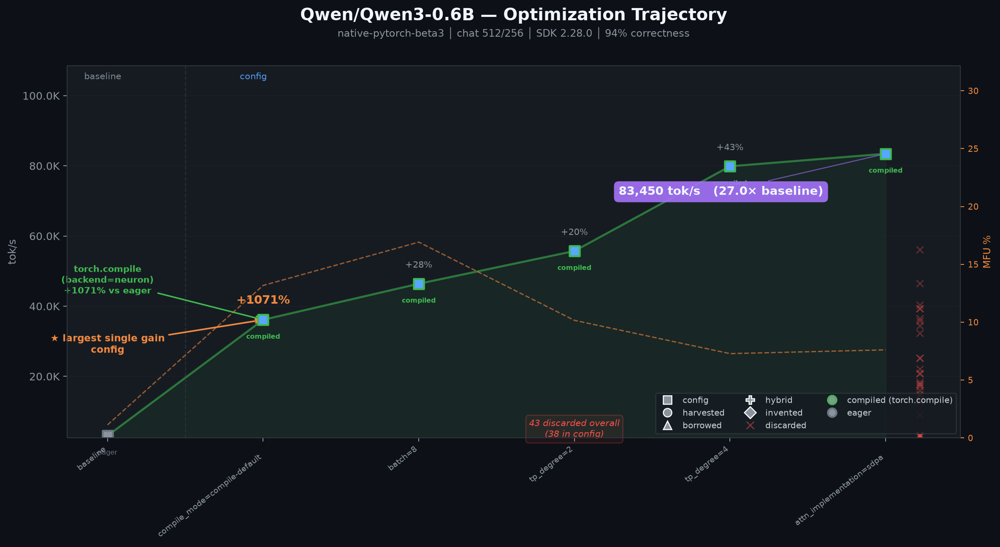
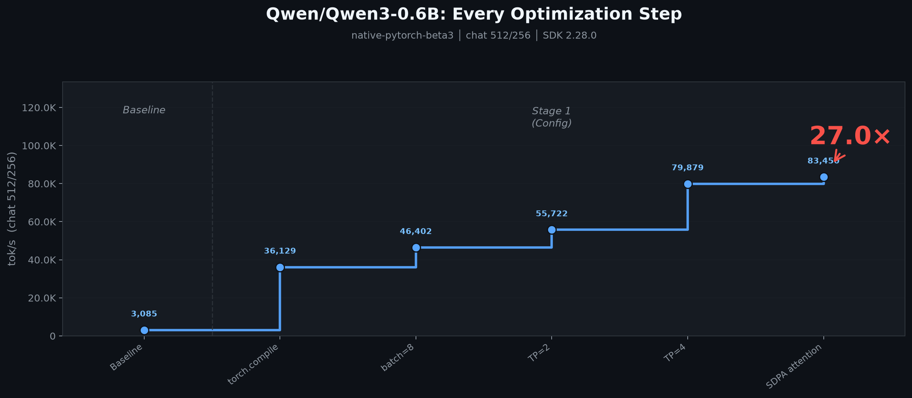

# Optimized Recipe: Qwen/Qwen3-0.6B

**83,450 tok/s** — 27.05x over baseline
(3,085 tok/s).

Backend: `native-pytorch-beta3`  ·  Correctness: **verified** (trusted-grader re-measure)
Generated: 2026-08-19T02:22:48Z

## Winning config

```json
{
  "tp_degree": 4,
  "weights_dtype": "bf16",
  "attn_implementation": "sdpa",
  "compile_mode": "compile-default",
  "batch": 8,
  "cp_degree": 1,
  "dp_degree": 1,
  "kv_replication": 1,
  "cores_used": 4,
  "cores_available": 4
}
```

## Kernels

- (none — config-only recipe)

## Toolchain (reproducibility)

```json
{
  "backend": "native-pytorch-beta3",
  "stack": "native-pytorch-beta3",
  "device_string": "neuron",
  "instance_type": "trn2.3xlarge",
  "torch": "2.12.1+cpu",
  "torch_neuronx": "2.12.3.0.0+unknown.dev",
  "neuronx_cc": "2.27.2878.0+8220f7ac",
  "nki": "0.6.0+30289107548.gd2d9cc57"
}
```

## Reproduce

```bash
./reproduce.sh
```

## Optimization timeline





See `results.tsv` for the full search trace behind these charts.
